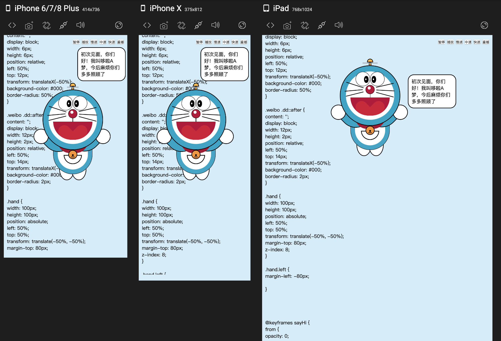

## 
## 会动的哆啦A梦
[Github仓库](https://github.com/dengzhixin/doraemon)
[Github预览](https://dengzhixin.github.io/doraemon/dist/index.html)
[Gitee仓库](https://gitee.com/dengzhixin/doraemon)
[Gitee预览](http://dengzhixin.gitee.io/doraemon/)
## 适配不同屏幕

## 运行
```$xslt
yarn start
```
## 打包
```$xslt
yarn build
```
## 其他
* 画出一个太极图
[GitHub仓库](https://github.com/dengzhixin/Tai-Chi)
[GitHub预览](https://dengzhixin.github.io/Tai-Chi/)
[Gitee仓库](https://github.com/dengzhixin/Tai-Chi)
[Gitee预览](https://dengzhixin.gitee.io/tai-chi/)
